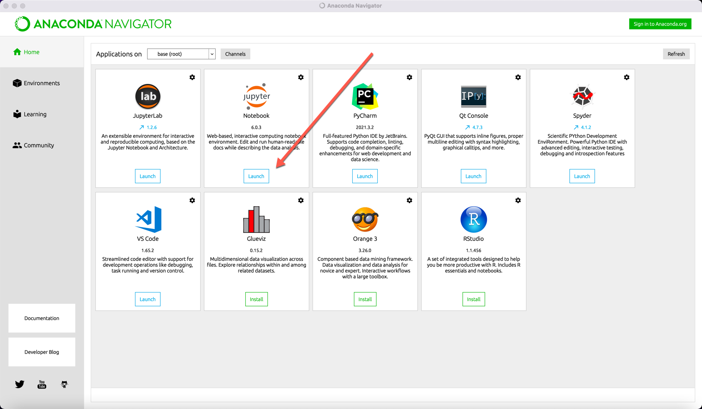
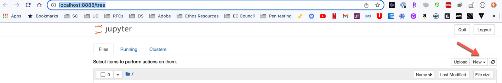
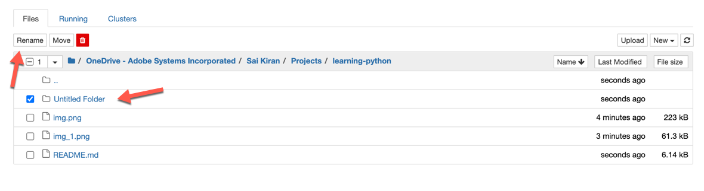
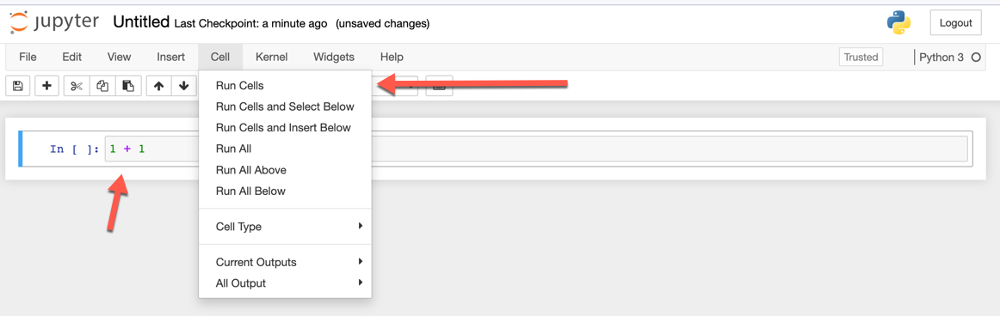
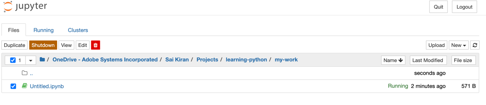
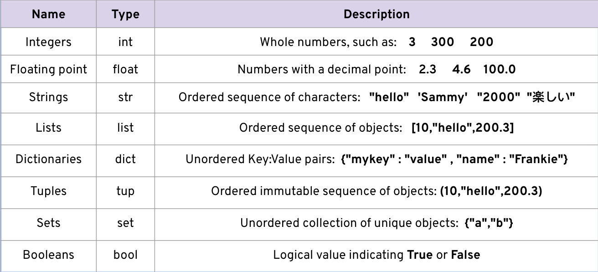
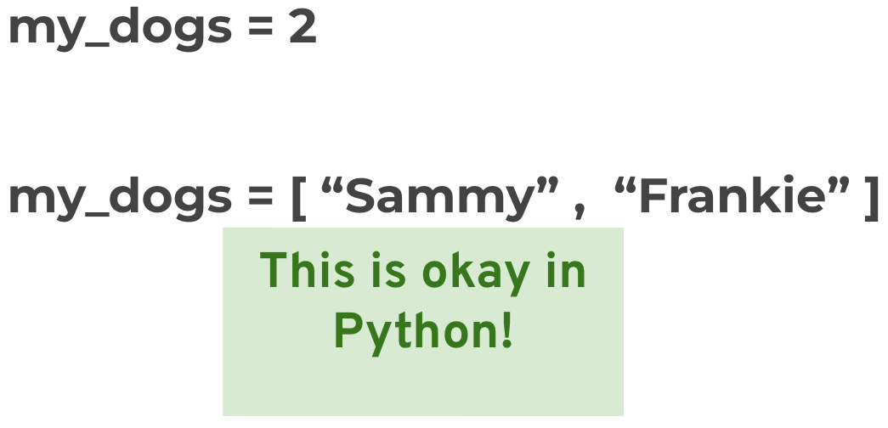

# Python Programming
<!-- START doctoc generated TOC please keep comment here to allow auto update -->
<!-- DON'T EDIT THIS SECTION, INSTEAD RE-RUN doctoc TO UPDATE -->
**Table of Contents**  *generated with [DocToc](https://github.com/thlorenz/doctoc)*

- [Python Programming](#python-programming)
  - [Course Overview and Installations](#course-overview-and-installations)
    - [Python 2 vs Python 3](#python-2-vs-python-3)
    - [Python Overview](#python-overview)
    - [Command Line Crash Course](#command-line-crash-course)
      - [Windows Command Line](#windows-command-line)
      - [macOS Command Line](#macos-command-line)
    - [Installing Python](#installing-python)
    - [Test driving Anaconda](#test-driving-anaconda)
    - [Running Python Code](#running-python-code)
  - [Python Object and Data Structure Basics](#python-object-and-data-structure-basics)
    - [Basic Data Types](#basic-data-types)
    - [Numbers](#numbers)
      - [Numbers - FAQ](#numbers---faq)
    - [Variable Assignments](#variable-assignments)
    - [Strings](#strings)
      - [String Formatting for Printing](#string-formatting-for-printing)
      - [Strings FAQ](#strings-faq)
      - [Print Formatting FAQS](#print-formatting-faqs)
      - [Exercises](#exercises)
    - [Lists](#lists)
      - [Exercises](#exercises-1)
    - [Dictionaries](#dictionaries)
      - [Exercises](#exercises-2)
    - [Tuples](#tuples)
    - [Sets](#sets)
      - [Exercises](#exercises-3)
    - [Booleans](#booleans)
    - [Files](#files)
      - [Exercises](#exercises-4)
  - [Python Comparison Operators](#python-comparison-operators)
  - [Python Statements](#python-statements)
    - [If, elif , else Statements](#if-elif--else-statements)
    - [For Loops](#for-loops)
    - [While Loops](#while-loops)
    - [Useful Operators](#useful-operators)
    - [List Comprehensions](#list-comprehensions)
    - [Assessment](#assessment)
  - [Methods and Functions](#methods-and-functions)
    - [Methods](#methods)
    - [Functions](#functions)
    - [def Keyword](#def-keyword)
    - [Basics of Python Functions](#basics-of-python-functions)
    - [Logic with Python Functions](#logic-with-python-functions)
    - [Tuple Unpacking with Python Functions](#tuple-unpacking-with-python-functions)
    - [Interactions between Python Functions](#interactions-between-python-functions)
    - [*args and **kwargs in Python](#args-and-kwargs-in-python)
    - [Exercises:](#exercises-5)
  - [Object Oriented Programming](#object-oriented-programming)
    - [Exercise](#exercise)
  - [Modules and Packages](#modules-and-packages)
    - [Using PyPi With pip install](#using-pypi-with-pip-install)
    - [Writing Your Own Modules and Packages](#writing-your-own-modules-and-packages)
    - [__name__ and __main__](#name-and-main)
  - [Errors and Exception Handling](#errors-and-exception-handling)
    - [Unit Testing](#unit-testing)

<!-- END doctoc generated TOC please keep comment here to allow auto update -->


## Course Overview and Installations

### Python 2 vs Python 3

- Choosing between Python 2 vs 3 used to be a very difficult decision for
  newcomers to the Python programming language.
- Many companies still had legacy Python 2 code to be maintained.
- Now every major external python package has been updated to support Python 3!
- Python 3 is the future of Python.
- We use Python 3 for this course.
- Old notebooks are available in case you need Python 2 information.
- Let’s get started by installing Python 3!

### Python Overview

- Brief History of Python
  - Created in 1990 by Guido van Rossum
  - Python 3 released in 2008
  - Specifically designed as an easy to use language
  - High focus on readability of code

- Why Choose Python?
  - Designed for clear, logical code that is easy to read and learn.
- Lots of existing libraries and frameworks written in Python allowing users to
  apply Python to a wide variety of tasks.
  - Focuses on optimizing developer time, rather than a computer’s processing
    time.
  - Great documentation online: [here](docs.python.org/3)

- What can you do with Python?
  - Automate simple tasks
  - Searching for files and editing them
  - Scraping information from a website
  - Reading and editing excel files
  - Work with PDFs
  - Automate emails and text messages
  - Fill out forms
  - Data Science and Machine Learning
    - Analyze large data files
    - Create visualizations
    - Perform machine learning tasks
    - Create and run predictive algorithms
  - Create websites
    - Use web frameworks such as Django and Flask to handle the backend of a
      website and user data
    - Create interactive dashboards for users

### Command Line Crash Course

- Before we install anything, its important to have a very quick overview of how
  to work at the command line.
- This allows you to programmatically move through your computer’s directories.
- We will cover:
  - Find your current directory
  - Listing all files in a directory
  - How to change directory
  - How to clear the command line screen

#### Windows Command Line

- Search for "cmd" in your search bar to open Command Prompt
- To find the current directory: `cd`
- To list all files in a directory: `dir`
- To change directory i.e. move to a different
  directory: `cd <Name of the directory>` e.g `cd Desktop`
- To clear the command line: `cls`

#### macOS Command Line

- Using the keys `CMD+Space` launch Spotlight and search for `Terminal` and
  launch it.
- To find current directory: `pwd`
- To list all files in a directory: `ls` (or `ls -a` to show all files including
  hidden files)
- To change directory: `cd <Name of the directory>` e.g `cd Desktop`
- To clear the command line: `clear`

__Note: You can use the `tab` key on your keyboard to autocomplete the file
names. After partially typing the file name hit the `tab` key to finish the rest
of the name. This is case insensitive in Windows, where as in Mac this is case
sensitive.__

### Installing Python

- There are many ways to run Python!
- Later on we’ll explore the difference between running a Python .py script or
  running Python code in a notebook environment.
  - Either way, we will still want to install Python!
- Installation Lecture:
  - Install Anaconda Distribution for Python.
  - Anaconda installs Python and an easy to use development environment and
    navigator launch tool.
  - Briefly run Jupyter Notebook.
    - Explore “no install” online options.

- Quick Note:
  - There are now many online “no install” Python environments that can run in
    the browser (as long as you have an internet connection).
  - While not officially part of the course, we will give you a brief tour of
    these online “no install” options at the end.

- To install Python we will use the free Individual Anaconda distribution.
- This distribution includes Python as well as many other useful libraries,
  including Jupyter Notebook environment.
- Anaconda can also easily be installed on to any major OS, Windows, MacOS, or
  Linux.
- Navigate to [Anaconda](https://www.anaconda.com/products/individual) download
  page and look for the `Download` button to download Anaconda.
  __Note: Please download the Graphical installer only__

- Free “No Install” Options:
  - jupyter.org/try
  - Google Collab Online Notebooks
  - Repl.it
- Google Search:
  - “Python Interpreter Online”
- Disadvantages of "No Install" options:
  - Hard to upload your own code,data, or notebooks!
  - May not save your code in the free version!
  - Not officially part of this course or supported by this course!

### Test driving Anaconda

- Launch Anaconda Navigator and click on `Launch` under `Jupyter Notebook` (not
  Jupyter Lab)
  

- This wll launch Jupyter Notebook editor in your Browser at
  location http://localhost:8888/tree



- This shows your directory structure of your user directory. Navigate to the
  desired folder where you'd like to store your Jupyter files and click on
  the `New` dropdown to select `Folder`.
- By default, the folder is created with name `Untitled Folder`. Click on the
  checkbox next to it and click on the `Rename` button to rename it.
  
- Now, click on the new folder you've created and from the `New` dropdown,
  select `Python 3` to create and launch a new Jupyter Notebook that uses Python
  3.
- In the cell which starts with `In [ ] :` enter `1 + 1` and click on
  the `Cells` option on the top and select `Run Cells`:
  

- You can also use the shortcut `Shift + Enter` to run the cell and create a new
  cell. Try it!
- Once you're done with your practice, you can shutdown the notebook by
  selecting it in the folder view and clicking on the `Shutdown` button. This
  will not delete the notebook.
  

### Running Python Code

- There are several ways to run Python code.
- First let’s discuss the various options for development environments
- There are 3 main types of environments:
  - Text Editors
  - Full IDEs
  - Notebook Environments


- Text Editors
  - General editors for any text file
  - Work with a variety of file types
  - Can be customized with plugins and add-ons
  - Keep in mind, most are not designed with only Python in mind.
  - Most popular: Sublime Text and Atom

- Full IDEs
  - Development Environments designed specifically for Python.
  - Larger programs.
  - Only community editions are free.
  - Designed specifically for Python, lots of extra functionality.
  - Most popular: PyCharm and Spyder

- Notebook Environments
  - Great for learning.
  - See input and output next to each other.
  - Support in-line markdown notes, visualizations, videos, and more.
  - Special file formats that are not .py
  - Most popular is Jupyter Notebook.

- Most important note:
  - Development Environments are a personal choice highly dependent on personal
    preference.
  - Choose whichever development environment you prefer!

- Let’s now explore how to run Python code:
  - First with an editor to create a .py script and run the file at your command
    line.
  - Then with a Jupyter Notebook.
  - First let’s download sublime text editor: www.sublimetext.com
  - Open Sublime and create a new folder with the following content:
  ```
    print('hello world!')
  ```
  - Save this file as `myexample.py`
  - Open Command prompt or Terminal and navigate to the folder where you stored
    the above file.
  - Now execute the file using the command `python myexample.py`.
  - You can also launch Python interpreter from command line using the
    command `python`. To quit the interpreter use the command `quit()`.

## Python Object and Data Structure Basics

### Basic Data Types

- In this section of the course we will cover the key data types in Python.
- These are your basic building blocks when constructing larger pieces of code.
- Let’s quickly discuss all of the possible data types, then we’ll have lectures
  that go into more detail about each one!



### Numbers

- There are two main number types we will work with:
  - Integers which are whole numbers.
- Floating Point numbers which are numbers with a decimal.
- Let’s explore basic math with Python!
- We will also discuss how to create variables and assign them values.
- Refer to the Notebook
  name: `code/00-Python Object and Data Structure Basics/01-Numbers.ipynb`

#### Numbers - FAQ

1. What's the difference between floating point and an integer? An integer has
   no decimals in it, a floating point number can display digits past the
   decimal point.

2. Why doesn't 0.1+0.2-0.3 equal 0.0 ? This has to do with floating point
   accuracy and computer's abilities to represent numbers in memory. For a full
   breakdown, check out: https://docs.python.org/2/tutorial/floatingpoint.html

### Variable Assignments

- We just saw how to work with numbers, but what do these numbers represent?
- It would be nice to assign these data types a variable name to easily
  reference them later on in our code!
- For example:

```python
  my_dogs = 2
```

- Rules for variable names
  - Names can not start with a number.
  - There can be no spaces in the name, use _ instead.
  - Can't use any of these symbols :'",<>/?|\()!@#$%^&*~-+
  - It's considered best practice (PEP8) that names are lowercase.
  - Avoid using words that have special meaning in Python like "list" and "str"

- Python uses Dynamic Typing
- This means you can reassign variables to different data types.
- This makes Python very flexible in assigning data types, this is different
  than other languages that are “Statically-Typed”
  

- Pros of Dynamic Typing:
  - Very easy to work with
  - Faster development time
- Cons of Dynamic Typing:
  - May result in bugs for unexpected data types!
  - You need to be aware of type()

- Refer to the
  notebook: `code/00-Python Object and Data Structure Basics/01-Variable Assignment.ipynb`

### Strings

- Strings are sequences of characters, using the syntax of either single quotes
  or double quotes:
  - 'hello'
  - "Hello"
  - " I don't do that "

- Because strings are ordered sequences it means we can using indexing and
  slicing to grab sub-sections of the string.
- Indexing notation uses [ ] notation after the string (or variable assigned the
  string).
- Indexing allows you to grab a single character from the string... These
  actions use [ ] square brackets and a number index to indicate positions of
  what you wish to grab.
  - Character :    h e l l o
  - Index :     0 1 2 3 4

- These actions use [ ] square brackets and a number index to indicate positions
  of what you wish to grab.
  - Character :    h e l l o
  - Index :     0 1 2 3 4
  - Reverse Index:    0 -4 -3 -2 -1
- Slicing allows you to grab a subsection of multiple characters, a “slice” of
  the string.
- This has the following syntax: [start:stop:step]
- start is a numerical index for the slice start
- stop is the index you will go up to (but not include)
- step is the size of the “jump” you take.

- Refer to the
  notebook: `code/00-Python Object and Data Structure Basics/02-Strings.ipynb`

#### String Formatting for Printing

- Often you will want to “inject” a variable into your string for printing. For
  example:

```python
my_name = “Jose”
print(“Hello ” + my_name)
```

- There are multiple ways to format strings for printing variables in them.
- This is known as string interpolation.
- Let’s explore two methods for this:
  - `.format()` method
  - `f-strings` (formatted string literals)

- Refer to the
  notebook: `code/00-Python Object and Data Structure Basics/03-Print Formatting with Strings.ipynb`

#### Strings FAQ

1. Are strings mutable? Strings are not mutable! (meaning you can't use indexing
   to change individual elements of a string)

2. How do I create comments in my code? You can use the hashtag # to create
   comments in your code

#### Print Formatting FAQS

1.) I imported print from the __future__ module, now print isn't working. What
happened?

This is because once you import from the __future__ module in Python 2.7, a
print statement will no longer work, and print must then use a print() function.
Meaning that you must use

print('Whatever you were going to print')

or if you are using some formatting:

print('This is a string with an {p}'.format(p='insert'))

The __future__ module allows you to use Python3 functionality in a Python2
environment, but some functionality is overwritten (such as the print statement,
or classic division when you import division).

Since we are using Jupyter Notebooks, once you so the import, all cells will
require the use if the print() function. You will have to restart Python or
start a new notebook to regain the old functionality back.

[HERE](https://pyformat.info/) IS AN AWESOME SOURCE FOR PRINT FORMATTING:

#### Exercises
1. Write a string index that returns just the letter 'r'  from 'Hello World' .

For example, 'Hello World'[0]  returns 'H'

2. Use string slicing to grab the word 'ink'  from inside 'tinker'

For example, 'education'[3:6]  returns 'cat'

Remember that when slicing you only go up to but not including the end index.

3. Write an expression using any of the string formatting methods we have learned (except f-strings, see note below) to return the phrase 'Python rules!'

For example, these phrases both return 'I like apples' :

```
'I like %s' %'apples'
'I like {}'.format('apples')
```


### Lists

- Lists are ordered sequences that can hold a variety of object types.
- They use [] brackets and commas to separate objects in the list.
  - [1,2,3,4,5]
- Lists support indexing and slicing. Lists can be nested and also have a
  variety of useful methods that can be called off of them.

- Refer to the
  notebook: `code/00-Python Object and Data Structure Basics/04-Lists.ipynb`

#### Exercises
1. Create a list that contains at least one string, one integer and one float.

For example:

[1, 'two', 3.14159]

Note that the order and number of items doesn't matter.

### Dictionaries

- Dictionaries are unordered mappings for storing objects.
- Previously we saw how lists store objects in an ordered sequence, dictionaries
  use a key-value pairing instead.
- This key-value pair allows users to quickly grab objects without needing to
  know an index location.
- Dictionaries use curly braces and colons to signify the keys and their
  associated values.
  ```python
    {'key1':'value1','key2':'value2'}
  ```

__So when to choose a list and when to choose a dictionary?__

- Dictionaries:  Objects retrieved by key name.
  - Unordered and can not be sorted.
- Lists:  Objects retrieved by location.
  - Ordered Sequence can be indexed or sliced.

- Refer to the notebook
  at: `code/00-Python Object and Data Structure Basics/05-Dictionaries.ipynb`

#### Exercises
1. Create a dictionary where all the keys are strings, and all the values are integers.

For example:

{'Monday':19, 'Tuesday':20}


### Tuples

- Tuples are very similar to lists. However they have one key difference -
  immutability.
- Once an element is inside a tuple, it can not be reassigned.
- Tuples use parenthesis:  (1,2,3)

- Refer to the notebook
  at: `code/00-Python Object and Data Structure Basics/06-Tuples.ipynb`

### Sets

- Sets are unordered collections of unique elements.
- Meaning there can only be one representative of the same object.
- Refer to the notebook
  at: `code/00-Python Object and Data Structure Basics/07-Sets and Booleans.ipynb`

#### Exercises
1. Write an expression that would turn the string 'Mississippi'  into a set of unique letters.

For example:

set('Parallel')

would return the set {'P', 'a', 'e', 'l', 'r'}

### Booleans

- Booleans are operators that allow you to convey True or False statements.
- These are very important later on when we deal with control flow and logic!
- Refer to the notebook
  at: `code/00-Python Object and Data Structure Basics/07-Sets and Booleans.ipynb`

### Files

- Before we finish this section, let’s quickly go over how to perform simple I/O
  with basic .txt files.
- We’ll also discuss file paths on your computer
- Refer to the notebook
  at: `code/00-Python Object and Data Structure Basics/08-Files.ipynb`

#### Exercises
1. This exercise will require several lines of code.

Write a script that opens a file named 'test.txt' , writes 'Hello World'  to the file, then closes it.

For example, the following code opens a file called 'myfile.txt' , writes 'This is my file' , and closes it:

```
x = open('myfile.txt', 'w')
x.write('This is my file')
x.close()
```

## Python Comparison Operators
Refer to the notebooks at: `code/01-Python Comparison Operators`

## Python Statements
### If, elif , else Statements

- Let’s begin to learn about __control flow__.
- We often only want certain code to execute when a particular condition has been met.
- For example, `if`  my dog is hungry (some condition), then I will feed the dog (some action).
- To control this flow of logic we use some keywords:
  - if
  - elif
  - else

- Control Flow syntax makes use of colons and indentation (whitespace).

- This indentation system is crucial to Python and is what sets it apart from other programming languages.

- Syntax of an if statement

```
if some_condition:
  # execute some code
```

- Syntax of an if/else statement
```
if some_condition:
  # execute some code
else:
  # do something else

```


- Syntax of an if/else statement

```
if some_condition:
  # execute some code
elif some_other_condition:
  # do something different
else:
  # do something else
```

- Refer to the Notebook:
  - `code/02-Python Statements/01-Introduction to Python Statements.ipynb`
  - `code/02-Python Statements/02-if, elif, and else Statements.ipynb`

### For Loops
- Many objects in Python are “iterable”, meaning we can iterate over every element in the object.
- Such as every element in a list or every character in a string.
- We can use for loops to execute a block of code for every iteration.
- The term iterable means you can “iterate” over the object.
- For example you can iterate over every character in a string, iterate over every item in a list, iterate over every key in a dictionary.
- Syntax of a for loop
```
my_iterable = [1,2,3]
for item_name in my_iterable:
  print(item_name)
```
Outputs:
```
>> 1
>> 2
>> 3
```

- Refer to the Notebook: `code/02-Python Statements/03-for Loops.ipynb`

### While Loops
- While loops will continue to execute a block of code `while` some condition remains True.
- For example, `while` my pool is not full, keep filling my pool with water.
- Or `while` my dogs are still hungry, keep feeding my dogs.
- Syntax of a while loop
```
while some_boolean_condition:
  #do something
```

- You can combine with an else if you want
```
while some_boolean_condition:
  #do something
else:
	#do something different
```

- Refer to the Notebook: `code/02-Python Statements/04-while Loops.ipynb`

### Useful Operators
- Refer to the Notebook: `code/02-Python Statements/05-Useful-Operators.ipynb`

### List Comprehensions
- List Comprehensions are a unique way of quickly creating a list with Python.
- If you find yourself using a for loop along with .append() to create a list, List Comprehensions are a good alternative!
- Refer to the Notebook: `code/02-Python Statements/06-List Comprehensions.ipynb`

### Assessment
- Refer to the Notebook `code/02-Python Statements/07-Statements Assessment Test.ipynb` for the test.
- The solutions for the assessment is in the Notebook `08-Statements Assessment Test - Solutions.ipynb`. Before you refer to the solutions, take some time to answer the questions.
- Only refer to the solutions if you're blocked or have completed the assessment.

## Methods and Functions
### Methods
- Built-in objects in Python have a variety of methods you can use!
- Let’s explore in a bit more detail how to find methods and how to get information about them.
- Refer tot he Notebook in `code/03-Methods and Functions/01-Methods.ipynb`

### Functions
- Creating clean repeatable code is a key part of becoming an effective programmer.
- Functions allow us to create blocks of code that can be easily executed many times, without needing to constantly rewrite the entire block of code.
- Functions will be a huge leap forward in your capabilities as a Python programmer.
- This means that the problems you are able to solve can also be a lot harder!
- It is very important to get practice combining everything you’ve learned so far (control flow, loops, etc.) with functions to become an effective programmer.
### def Keyword
- Creating a function requires a very specific syntax, including the def keyword, correct indentation, and proper structure.
- Let’s get an overview of a Python function structure.

```
def name_of_function():
```

- Typically we use the return keyword to send back the result of the function, instead of just printing it out.
- **return** allows us to assign the output of the function to a new variable. 
- We will have a deeper discussion of the return keyword later on in the notebook.
```
def add_function(num1,num2):
  return num1+num2
```
Outputs:
```
>> result = add_function(1,2)
>> 
>> print(result)
>> 3
```

### Basics of Python Functions
- Refer to the Notebook: `code/03-Methods and Functions/02-Functions.ipynb`

### Logic with Python Functions
- Refer to the Notebook: `code/03-Methods and Functions/02-Functions.ipynb`

### Tuple Unpacking with Python Functions
- Refer to the Notebook: `code/03-Methods and Functions/02-Functions.ipynb`

### Interactions between Python Functions
- Refer to the Notebook: `code/03-Methods and Functions/02-Functions.ipynb`

### *args and **kwargs in Python
- Stand for arguments and keyword arguments
- Allows us to take an arbitrary number of arguments.

```python
def myfunc(*args):
  print(args)
  return sum(args) * 0.05
```

- `args` can be replaced with any other word like `*spam` etc. The `*` before the word is important.

- `**kwargs` builds a dictionary of arguments.

```python
def myfunc(**kwargs):
  print(kwargs)
  if 'fruit` in kwargs:
    print('My fruit of choice is {}'.format(kwargs['fruit']))
  else
    print('No fruit found')

myfunc(fruit='apple', veggie = 'lettuce')
```

### Exercises:
1. Write a function called myfunc that prints the string 'Hello World'.
2. Define a function called myfunc that takes in a name, and prints 'Hello Name' 
3. Define a function called myfunc that takes in a Boolean value (True or False). If True, return 'Hello', and if False, return 'Goodbye'
4. Define a function called myfunc that takes three arguments, x, y and z.
If z is True, return x.  If z is False, return y.
5. Define a function called myfunc that takes in two arguments and returns their sum.
6. Define a function called is_even that takes in one argument, and returns True if the passed-in value is even, False if it is not.
7. Define a function called is_greater that takes in two arguments, and returns True if the first value is greater than the second, False if it is less than or equal to the second.
8. Define a function called myfunc that takes in an arbitrary number of arguments, and returns the sum of those arguments.
9. Define a function called myfunc that takes in an arbitrary number of arguments, and returns a list containing only those arguments that are even.
10. Define a function called myfunc that takes in a string, and returns a matching string where every even letter is uppercase, and every odd letter is lowercase. Assume that the incoming string only contains letters, and don't worry about numbers, spaces or punctuation. The output string can start with either an uppercase or lowercase letter, so long as letters alternate throughout the string.

## Object Oriented Programming
- Object Oriented Programming (OOP) allows programmers to create their own objects that have methods and attributes.
- Recall that after defining a string,list, dictionary, or other objects, you were able to call methods off of them with the .method_name() syntax.

- These methods act as functions that use information about the object, as well as the object itself to return results, or change the current object.
- For example this includes appending to a list, or counting the occurences of an element in a tuple.
- OOP allows users to create their own objects.
- The general format is often confusing when first encountered, and its usefulness may not be completely clear at first.
- In general, OOP allows us to create code that is repeatable and organized.
- For much larger scripts of Python code, functions by themselves aren’t enough for organization and repeatability.
Commonly repeated tasks and objects can be defined with OOP to create code that is more usable.

- Let’s check out the syntax.

```
class NameOfClass():
	
     				def __init__(self,param1,param2):
		self.param1 = param1
		self.param2 = param2
	
	def some_method(self):
		# perform some action
		print(self.param1)
```

- Let’s explore Object Oriented Programming in more detail with code!
- Refer to the notebook at `code/05-Object Oriented Programming/01-Object Oriented Programming.ipynb`

### Exercise
- Problem statement is defined in the noteboo: `code/05-Object Oriented Programming/01-Object Oriented Programming.ipynb`


## Modules and Packages
### Using PyPi With pip install
- `PyPI` is a repository for open-source third-party Python packages. 
- It's similar to RubyGems in the Ruby world, PHP's Packagist, CPAN for Perl, and NPM for Node.js.
- So far we’ve really only used libraries that come internally with Python.
- There are many other libraries available that people have open-sourced and shared on `PyPi`.
- We can use `pip install` at the command line to install these packages. 
- By installing Python from python.org or through the Anaconda distribution you also installed pip
- `pip` is a simple way to download packages at your command line directly from the PyPi repository
- There are packages already created for almost any use case you can think of!
- A quick google search will usually help you discover a link to the PyPi page for the package, or for the package documentation.
- Let’s quickly show you how to download and install external packages.
  - Windows Users: Command Prompt
  - MacOS/Linux Users: Terminal

### Writing Your Own Modules and Packages
- Now that we understand how to install external packages, let’s explore how to create our own modules and packages. 
- Modules are just .py scripts that you call in another .py script.
- Packages are a collection of modules.

### __name__ and __main__
- An often confusing part of Python is a mysterious line of code:
```python
if __name__ == "__main__":
```

- Sometimes when you are importing from a module, you would like to know whether a modules function is being used as an import, or if you are using the original .py file of that module.
- Let’s explore this some more, but make sure to check out the full explanatory text file that is in this part’s folder!

## Errors and Exception Handling
- Errors are bound to happen in your code! 
- Especially when someone else ends up using it in an unexpected way.
- We can use error handling to attempt to plan for possible errors.
- For example, a user may try to write to a file that was only opened in mode=’r’
- Currently if there is any type of error in your code, the entire script will stop.
- We can use Error Handling to let the script continue with other code, even if there is an error.
- We use three keywords for this:
  - `try`: This is the block of code to be attempted (may lead to an error)
  - `except`: Block of code will execute in case there is an error in try block
  - `finally`: A final block of code to be executed, regardless of an error.

### Unit Testing
- As you begin to expand to larger multi-file projects it becomes important to have tests in place.
- This way as you make changes or update your code, you can run your test files to make sure previous code still runs as expected.
- There are several testing tools, we will focus on two:
  - `pylint`: This is a library that looks at your code and reports back possible issues.
  - `unittest`: This built-in library will allow to test your own programs and check you are getting desired outputs.
- We’ll begin by showing you how to use pylint to check your code for possible errors and styling. 
- Python as a set of style convention rules known as “PEP 8”.
- For this lecture we will be creating .py scripts in sublime.
- You can still use the associated notebook for code using the %%writefile magic jupyter command.
